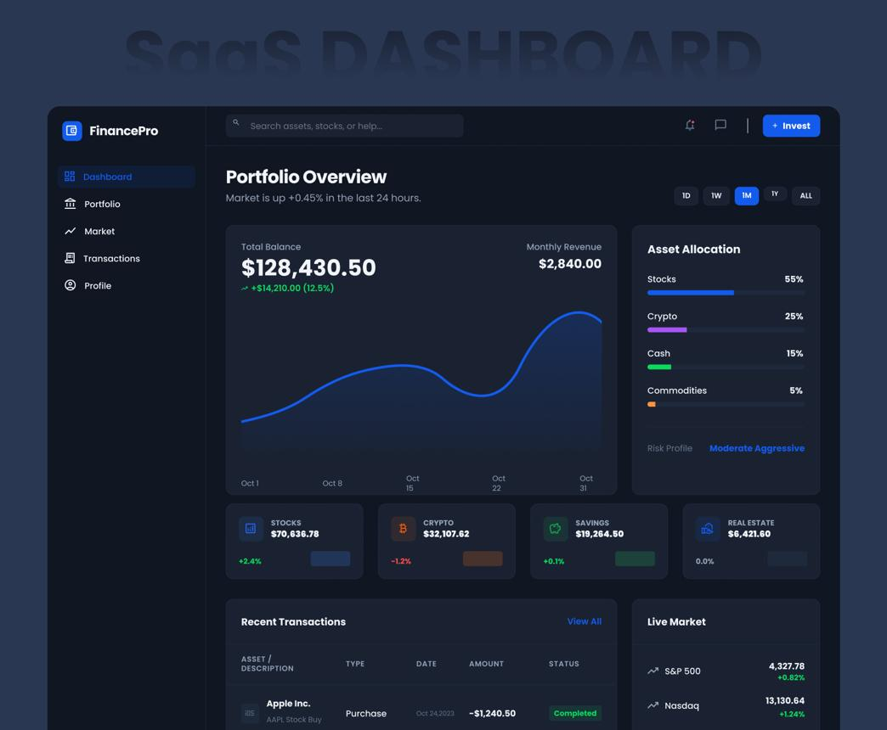
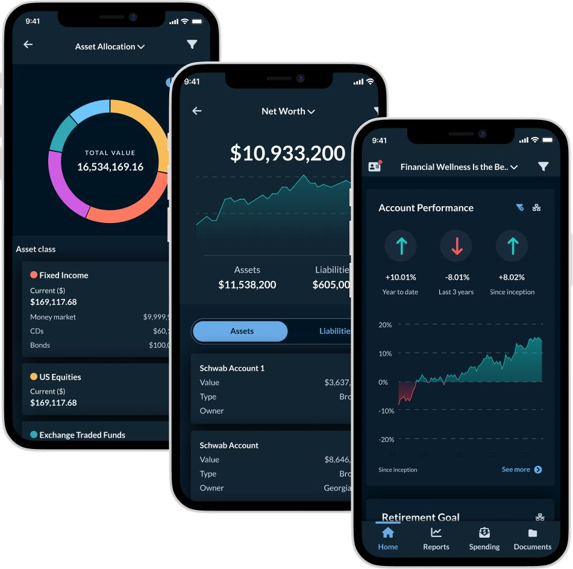
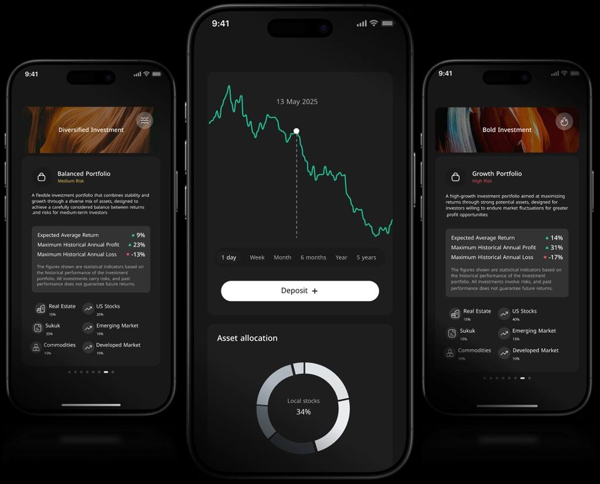
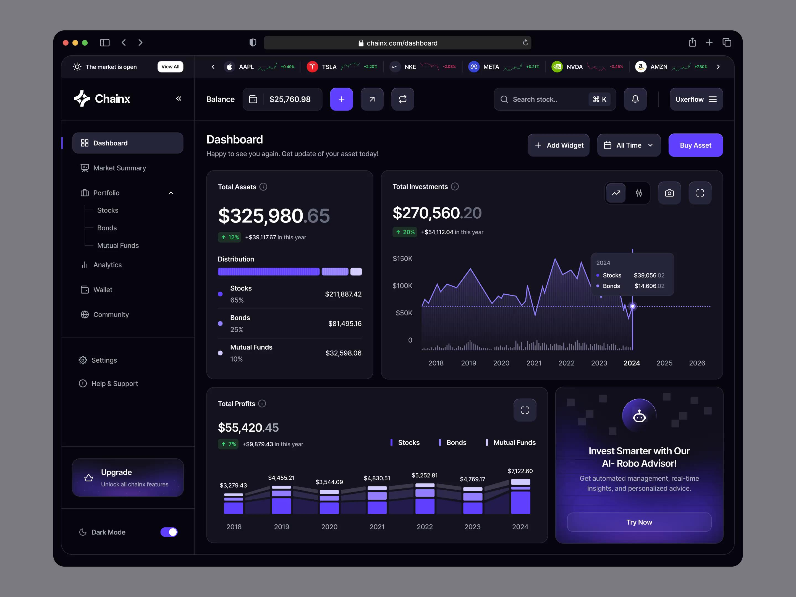
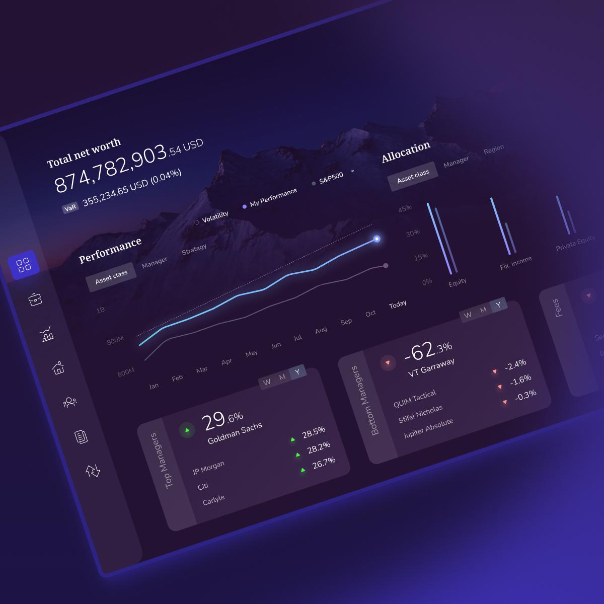
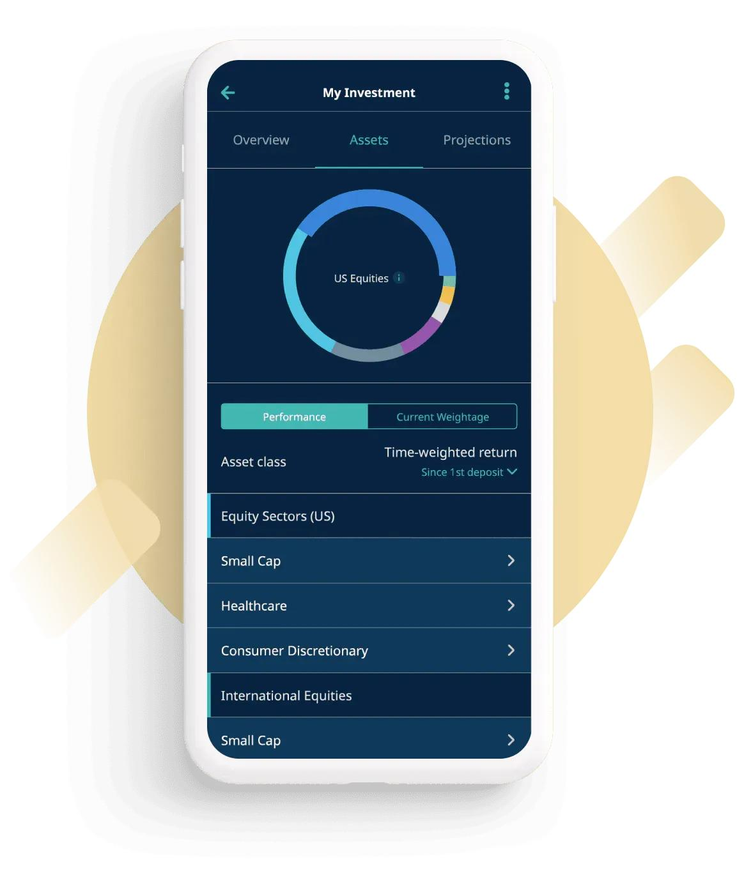
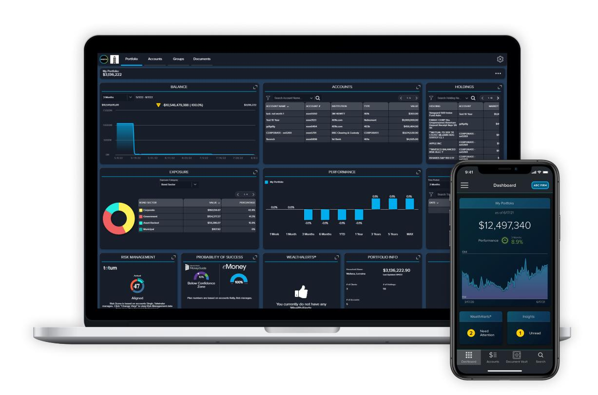
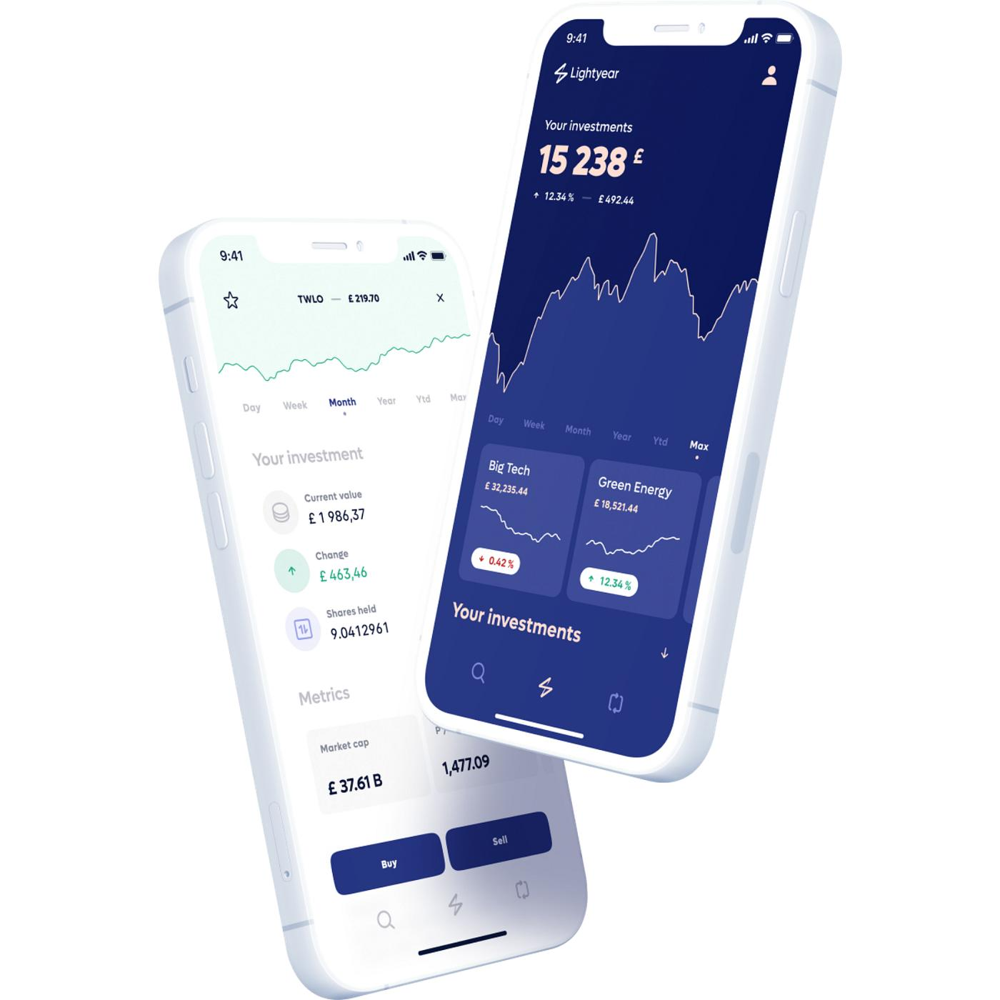

# Finance UI Visual Specification

## Visual identity

The application is a sober personal finance/investment product. It should feel closer to a professional wealth-management platform than a consumer shopping or gamified finance app.

Keywords:
- trustworthy
- precise
- calm
- institutional
- modern fintech
- information-first

## Color system

### Light theme
| Token | HEX | Usage |
|---|---|---|
| Navy900 | #0B1F33 | primary navigation, major headings |
| Navy800 | #123A5A | primary actions, selected controls |
| Navy700 | #1F5A82 | secondary actions, chart emphasis |
| Blue600 | #2F80C0 | links, interactive accents |
| Gray50 | #F5F7FA | application background |
| White | #FFFFFF | cards and elevated surfaces |
| Gray100 | #EEF2F5 | secondary surfaces |
| Gray200 | #D7E0E7 | borders/dividers |
| Gray400 | #9AA7B2 | disabled text/icons |
| Gray500 | #5B6B78 | secondary text |
| Gray900 | #172B3A | primary text |
| Positive | #287A5A | gains/success |
| Negative | #B54848 | losses/errors |
| Warning | #A87519 | warnings |

### Dark theme
| Token | HEX |
|---|---|
| Background | #08131F |
| Surface | #0D1D2C |
| Elevated | #13283A |
| Primary | #4A91C5 |
| PrimaryLight | #73B1D8 |
| TextPrimary | #E8EEF3 |
| TextSecondary | #AAB9C5 |
| Border | #263D50 |
| Positive | #4DA67D |
| Negative | #D06A6A |
| Warning | #D0A34A |

## Graphics

Use graphics to explain financial information rather than decorate screens.

Preferred:
- allocation donut charts
- portfolio performance line charts
- budget-versus-actual bars
- compact sparklines
- budget utilization progress indicators
- transaction/document illustrations
- account and portfolio icons

Chart palette should normally use #2F80C0 for the primary series, #287A5A for positive performance, #B54848 for negative performance, and #D7E0E7 for grids/borders.

Do not use arbitrary rainbow palettes.

## Image direction

When a screen requires an image, prefer one of three categories:

1. Product illustration: abstract financial geometry, charts, documents, cards, accounts.
2. Editorial finance imagery: restrained architecture, professional workspace, subtle market context.
3. Asset imagery: clean, factual imagery directly related to the asset being analyzed.

Avoid generic stock-photo people, piles of money, coins, exaggerated trading-floor imagery, neon crypto aesthetics, and decorative imagery unrelated to the user's financial task.

## Suggested image-generation prompt

"Premium financial application visual, sober institutional fintech aesthetic, deep navy #0B1F33, slate blue #1F5A82, accent blue #2F80C0, cool gray #F5F7FA, professional wealth-management design, restrained composition, precise geometric financial graphics, subtle lighting, clean negative space, no gradients, no neon, no clutter."

## Screen hierarchy

Use this general order where appropriate:

1. Page title / selected period
2. Primary metric
3. Secondary metrics
4. Chart or visual analysis
5. Detailed financial data
6. Primary action

The first viewport should answer the screen's primary financial question quickly.

## Baseline UI Hierarchy

- [baseline hierarchy](finance-ui-hierarchy-baseline.png).

This image is the visual baseline for screen background hierarchy.

AI-generated UI implementations should preserve the hierarchy represented
in this reference while using the semantic Compose Material 3 theme tokens
defined by the project.

Do not copy visual elements literally when they conflict with the project's
architecture, accessibility requirements, or platform conventions.

- The generated baseline establishes five visual hierarchy levels:
- | Level | Purpose              | Light     | Dark      |
  | ----- | -------------------- | --------- | --------- |
  | 1     | App background       | `#F5F7FA` | `#08131F` |
  | 2     | Surface background   | `#EEF2F5` | `#0D1D2C` |
  | 3     | Elevated surface     | `#FFFFFF` | `#13283A` |
  | 4     | Primary surface      | `#0B1F33` | `#4A91C5` |
  | 5     | Accent / interactive | `#2F80C0` | `#73B1D8` |

- The image also demonstrates how these levels should be applied to Dashboard, Portfolio, Transactions, Account Details, and Settings

Implement the Portfolio screen following [specification](finance-ui-visual-spec.md) and use design/finance-ui-hierarchy-baseline.png as the visual reference. Use the existing Compose Material 3 theme and do not introduce hard-coded colors.

## Design reference

Some designs suggestions  are show in design folder for files:

